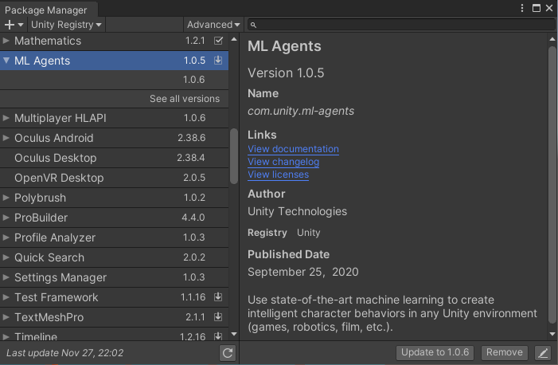
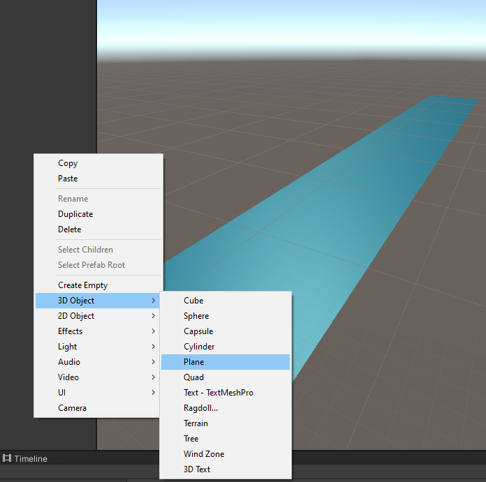
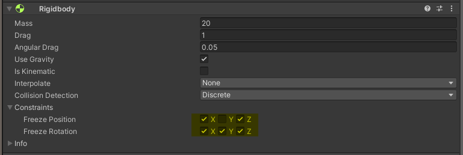
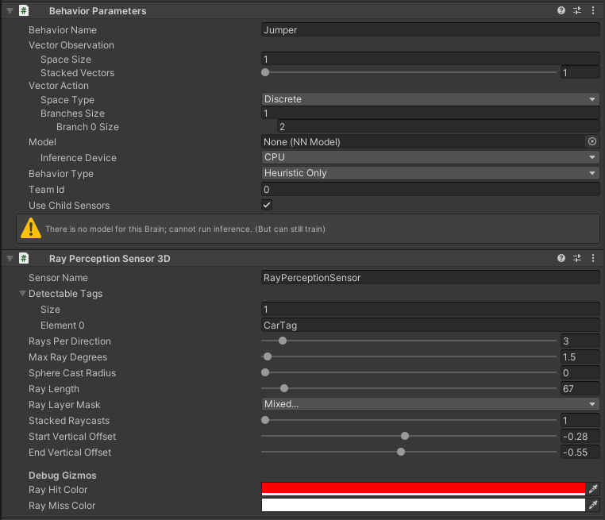
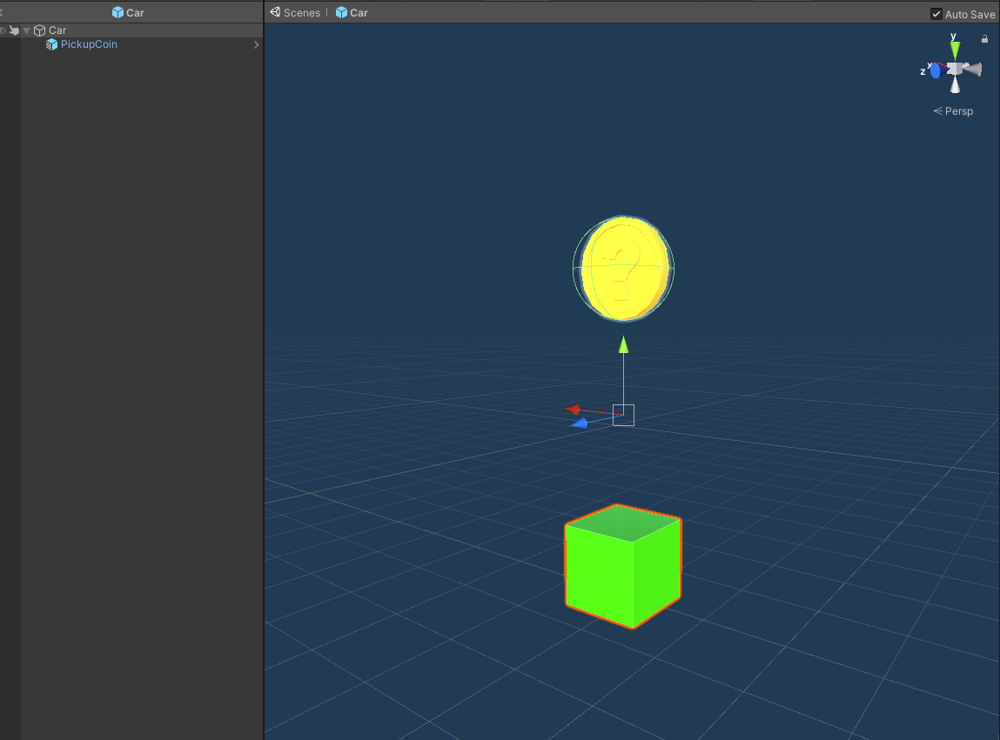
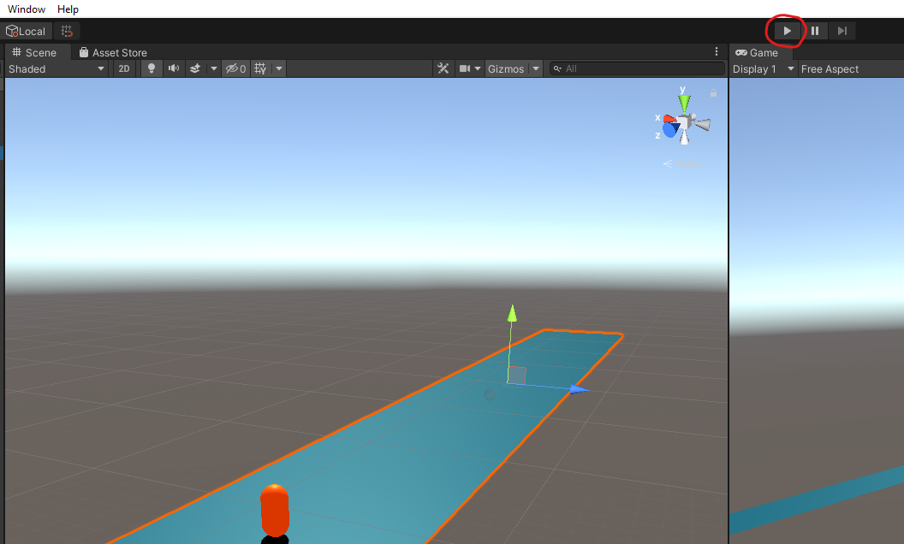

# Week 8 + 9 - ML Agents Deel III: Jumper Exercise

## Alina Storme & Turpal Dzhamaldayev

## Inleiding
In dit project zult u stapsgewijs begeleid worden om zelf ML-Agents op te zetten en te trainen.

## Probleem omschrijving :
De Jumper agent is niet zo slim en blijft op de weg stilstaan om het laatste berichtje uit te typen en wordt aangereden door een auto.


## Het einddoel :
De bedoeling hierbij is om de Jumper agent uit zijn eigen fouten te laten leren. Indien de training goed verloopt, zal de agent omhoog springen om de auto te ontwijken (__!!!probeer dit niet thuis!!!__).


## Project structuur ziet er als volgt uit :
```
Scene
│   Main Camera
│   Directional Light    
│
└───Environment
    │   ScoreText
    │   Road
    │
    └───Spawner
        │   JumperGuy
```
## Prerequisites :
### ML-Agents installeren via de Package Manager
1. Creëer een leeg project
2. Installeer ML-Agents (hierbij is het belangrijk dat men de volgende versie kiest : 1.0.5)



## Stap 1 : Creëer een __Plane__ object die als de weg zal fungeren


## Stap 2 : Maak een leeg __GameObject__ aan en noem deze "Spawner"
1. Dit game object gaat op een willekeurige snelheid auto's spawnen.
2. Voeg het volgende script hieraan toe :
```c#
public class Spawner : MonoBehaviour
{
    [Header("Instellingen")]
    [SerializeField] private GameObject spawnableObject;
    [SerializeField] private float minSpawnIntervalInSeconds;
    [SerializeField] private float maxSpawnIntervalInSeconds;

    private Jumper jumper;
    private List<GameObject> spawnedObjects = new List<GameObject>();

    private void Update()
    {
        RemoveOldCars();
    }

    private void Awake()
    {
        jumper = GetComponentInChildren<Jumper>();
        jumper.OnReset += DestroyAllSpawnedObjects;

        StartCoroutine(nameof(Spawn));
    }

    private IEnumerator Spawn()
    {
        var spawned = Instantiate(spawnableObject, transform.position, transform.rotation, transform);
        spawnedObjects.Add(spawned);

        yield return new WaitForSeconds(Random.Range(minSpawnIntervalInSeconds, maxSpawnIntervalInSeconds));
        StartCoroutine(nameof(Spawn));
    }
    private void DestroyAllSpawnedObjects()
    {
        for (int i = spawnedObjects.Count - 1; i >= 0; i--)
        {
            Destroy(spawnedObjects[i]);
            spawnedObjects.RemoveAt(i);
        }
    }

    // Wanneer de auto een bepaalde Z-positie bereikt zal deze verwijderd worden uit de lijst van objecten
    public void RemoveOldCars()
    {
        for (int i = spawnedObjects.Count - 1; i >= 0; i--)
        {
            if (spawnedObjects[i].transform.position.z > 60f)
            {
                Destroy(spawnedObjects[i].gameObject);
                spawnedObjects.RemoveAt(i);
            }
        }
    }
}
```

## Stap 3 : Maak een agent aan en noem deze "Jumper"
Men mag zelf kiezen welke vorm dat men aan de agent geeft, dit kan later heel gemakkelijk aangepast worden. We zullen het hierbij heel simpel houden en kiezen voor een capsule. Aan de agent-object zal men een _Jumper_ tag toewijzen.


1. Voeg een __Rigidbody__ aan de agent toe en vink de volgende <em>constraints</em> aan :

Dit zal ervoor zorgen dat de agent niet zal omvallen en geen onnodige bewegingen kan uitvoeren.




2. Voeg de __Behavior Parameters__ en __Ray Perception Sensor 3D__ scripts hieraan toe, die standaard voorzien worden in de __ML-Agents__ library.



3. Voeg ook het __Jumper__ script hieraan toe :

```c#
public class Jumper : Agent
{
    [Header("Instellingen")]
    [SerializeField] private float jumpForce;
    [SerializeField] private KeyCode jumpKey;

    private bool jumpIsReady = true;
    private Rigidbody rBody;
    private Vector3 startingPosition;
    private int score = 0;

    public event Action OnReset;

    public override void Initialize()
    {
        rBody = GetComponent<Rigidbody>();
        startingPosition = transform.position;
    }

    private void FixedUpdate()
    {
        if (jumpIsReady)
            RequestDecision();
    }

    public override void OnActionReceived(float[] vectorAction)
    {
        if (Mathf.FloorToInt(vectorAction[0]) == 1)
            Jump();
    }

    public override void OnEpisodeBegin()
    {
        Reset();
    }

    public override void Heuristic(float[] actionsOut)
    {
        actionsOut[0] = 0;

        if (Input.GetKey(jumpKey))
            actionsOut[0] = 1;
    }

    private void Jump()
    {
        if (jumpIsReady)
        {
            rBody.AddForce(new Vector3(0, jumpForce, 0), ForceMode.VelocityChange);
            jumpIsReady = false;
        }
    }

    private void Reset()
    {
        jumpIsReady = true;

        transform.position = startingPosition;
        rBody.velocity = Vector3.zero;
        OnReset?.Invoke();
    }

    private void OnCollisionEnter(Collision collidedObj)
    {
        if (collidedObj.gameObject.CompareTag("Street"))
            jumpIsReady = true;

        else if (collidedObj.gameObject.CompareTag("CarTag"))
        {
            Debug.Log("Crashed: Reward diminished");
            AddReward(-1.0f);
            EndEpisode();
        }
    }

    private void OnTriggerEnter(Collider collidedObj)
    {
        if (collidedObj.gameObject.CompareTag("Coin"))
        {
            Debug.Log("Rewarded: Coin");
            AddReward(0.1f);
        }
    }
}
```
## Stap 4 : Maak een gameObject aan en noem deze "ScoreText"
Dit game object zal fungeren als het scorebord van de Jumper oefening, en zal hierbij het cumulative reward weergeven.
```c#
public class Environment : MonoBehaviour
{
    private TextMesh scoreBoard;
    private Jumper jumperGuy;

    private void OnEnable()
    {
        scoreBoard = transform.GetComponentInChildren<TextMesh>();
        jumperGuy = transform.GetComponentInChildren<Jumper>();
    }

    void FixedUpdate()
    {
        scoreBoard.text = jumperGuy.GetCumulativeReward().ToString("f2");
    }
}
```
Aan de hand van het bovenstaande script wordt het scorebord beheerd.
## Stap 5 : Creëren van een auto prefab
Men mag zelf kiezen welke vorm dat men aan de auto geeft, dit kan later heel gemakkelijk aangepast worden. We zullen het hierbij heel simpel houden en kiezen voor een kubus. Aan het auto-object zal men een _CarTag_ tag toewijzen.



Aan deze kubus zal men het volgende script toevoegen :
```c#
public class CarMovement : MonoBehaviour
{
    [SerializeField] private float speed;
    private Rigidbody Rigidbody;

    [SerializeField] private float minSpeed = 5;
    [SerializeField] private float maxSpeed = 20;


    private void Awake()
    {
        Rigidbody = GetComponent<Rigidbody>();
    }

    private void FixedUpdate()
    {
        Rigidbody.velocity = Vector3.forward * Random.Range(minSpeed, maxSpeed);
    }
}
```
Als child object van de auto zal men een munt toevoegen die als beloning zal fungeren voor de agent (deze munt is gehaald uit de Standard Assets library van Unity). Aan het munt-object zal men een _Coin_ tag toewijzen.

Vrijblijvend mag hier een rotatiescript aan toegevoegd worden :
```c#
public class CoinRotation : MonoBehaviour
{
    public float speed = 50f;

    void Update()
    {
        transform.Rotate(Vector3.up * speed * Time.deltaTime);
    }

    private void OnTriggerEnter(Collider other)
    {
        if (other.gameObject.CompareTag("Jumper"))
        {
            Debug.Log("Collided with car");
            Destroy(gameObject);
        }
    }
}
```
## Reward systeem
Het reward systeem ziet er als volgt uit :
| Omschrijving   |      Reward      |
|----------|:-------------:|
| Botsing met een auto |  -1.0f |
| Collecten van een munt |    +0.1f   |
## Training
1. Configuratie :

Om de agent te trainen, gaan we gebruik maken van de volgende configuratie :
```yaml
behaviors:
  Jumper:
    trainer_type: ppo
    max_steps: 5.0e7
    time_horizon: 64
    summary_freq: 10000
    keep_checkpoints: 5
    checkpoint_interval: 50000

    hyperparameters:
      batch_size: 32
      buffer_size: 9600
      learning_rate: 3.0e-4
      learning_rate_schedule: constant
      beta: 5.0e-3
      epsilon: 0.2
      lambd: 0.95
      num_epoch: 3

    network_settings:
      num_layers: 2
      hidden_units: 128
      normalize: false
      vis_encoder_type: simple

    reward_signals:
      extrinsic:
        strength: 1.0
        gamma: 0.99
      curiosity:
        strength: 0.02
        gamma: 0.99
        encoding_size: 256
        learning_rate : 1e-3
```
Het is belangrijk dat men hierbij aangeeft dat de configuratie geldt voor de Jumper agent.
In de root map van het project maakt men een nieuwe __Learning__ map aan, met daarin het bovenstaande configuratiebestand. Er werd geopt om een betekenisvolle naamgeving te handhaven, hierbij werd er gekozen voor __Jumper-01.yml__ als eerste configuratie.

2. Begin van de training :

Open command line in de __Learning__ map, en run volgende commando :
```
mlagents-learn Jumper-01.yml --run-id Jumper01
```
Om de training te beginnen, drukken we op de play knop in Unity.



3. Tensorboard :

Om de tensorboard server op te starten, gaat men het volgende commando runnen in de __Learning__ map :
```
tensorboard --logdir results
```
Hier verkrijgt men een overzicht van de resultaten.


## Bronvermelding
Dapper Dino (2020-06-16), “How To Create Your Own Flappy Bird AI - Unity Ml-Agents”. Opgehaald van https://www.youtube.com/watch?v=ToMCmHQocSA&t=928s

Simonini, T (2020-01-30), "An Introduction to Unity ML-Agents". Opgehaald van https://towardsdatascience.com/an-introduction-to-unity-ml-agents-6238452fcf4c

Schuchmann, S (2020-05-19), "Ultimate Walkthrough for ML-Agents in Unity3D". Opgehaald van https://towardsdatascience.com/ultimate-walkthrough-for-ml-agents-in-unity3d-5603f76f68b