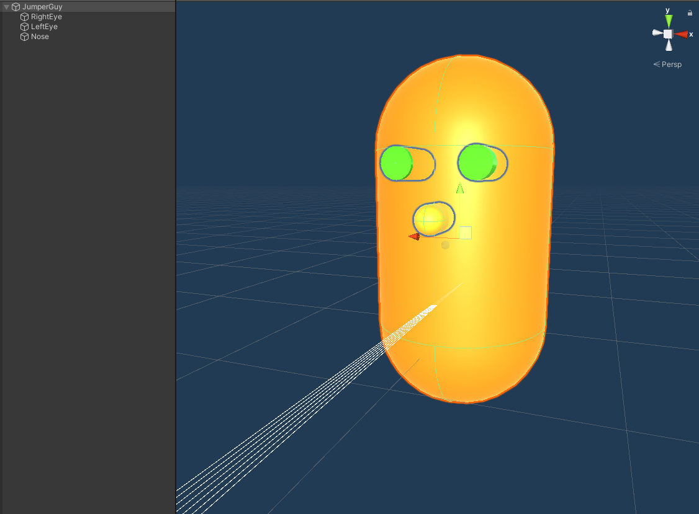

# Week 8 + 9 - ML Agents Deel III: Jumper Exercise

## Alina Storme & Turpal Dzhamaldayev

## Inleiding
In dit project zult u stapsgewijs begeleid worden om zelf ML-Agents op te zetten en te trainen.

## Probleem omschrijving :
De Jumper agent is niet zo slim en blijft op de weg stilstaan om het laatste berichtje uit te typen en wordt aangereden door een auto.


## Het einddoel :
De bedoeling hierbij is om de Jumper agent uit zijn eigen fouten te laten leren. Indien de training goed verloopt, zal de agent omhoog springen om de auto te ontwijken (__!!!probeer dit niet thuis!!!__).


## Project structuur ziet er als volgt uit :
```
Scene
│   Main Camera
│   Directional Light    
│
└───Environment
    │   ScoreText
    │   Road
    │
    └───Spawner
        │   JumperGuy
```
## Prerequisites :
### ML-Agents installeren via de Package Manager
1. Creëer een lege project
2. Installeer ML-Agents (hierbij is het belangrijk dat men de volgende versie kiest : 1.0.5)


## Stap 1 : Creëer een __Plane__ object die als de weg zal fungeren


## Stap 2 : Maak een lege __GameObject__ aan en noem deze "Spawner"
1. Deze game object gaat random auto's spawnen.
2. Voeg de volgende script hier aan toe :
```c#
public class Spawner : MonoBehaviour
{
    [Header("Instellingen")]
    [SerializeField] private GameObject spawnableObject;
    [SerializeField] private float minSpawnIntervalInSeconds;
    [SerializeField] private float maxSpawnIntervalInSeconds;

    private Jumper jumper;
    private List<GameObject> spawnedObjects = new List<GameObject>();

    private void Update()
    {
        RemoveOldCars();
    }

    private void Awake()
    {
        jumper = GetComponentInChildren<Jumper>();
        jumper.OnReset += DestroyAllSpawnedObjects;

        StartCoroutine(nameof(Spawn));
    }

    private IEnumerator Spawn()
    {
        var spawned = Instantiate(spawnableObject, transform.position, transform.rotation, transform);
        spawnedObjects.Add(spawned);

        yield return new WaitForSeconds(Random.Range(minSpawnIntervalInSeconds, maxSpawnIntervalInSeconds));
        StartCoroutine(nameof(Spawn));
    }
    private void DestroyAllSpawnedObjects()
    {
        for (int i = spawnedObjects.Count - 1; i >= 0; i--)
        {
            Destroy(spawnedObjects[i]);
            spawnedObjects.RemoveAt(i);
        }
    }

    // Wanneer de auto een bepaalde Z-positie bereikt zal deze verwijderd worden uit de lijst van objecten
    public void RemoveOldCars()
    {
        for (int i = spawnedObjects.Count - 1; i >= 0; i--)
        {
            if (spawnedObjects[i].transform.position.z > 60f)
            {
                Destroy(spawnedObjects[i].gameObject);
                spawnedObjects.RemoveAt(i);
            }
        }
    }
}
```

## Stap 3 : Maak een agent aan en noem deze "Jumper"
Men mag zelf kiezen welke vorm dat men aan de agent geeft, dit kan later heel gemakkelijk aangepast worden. We zullen het hierbij heel simpel houden en kiezen voor een capsule.




1. Voeg een __Rigidbody__ aan toe en vink de volgende <em>constraints</em> aan :

Dit zal ervoor zorgen dat de agent niet zal omvallen en geen onnodige bewegingen kan uitvoeren.


2. Voeg de __Behavior Parameters__ en __Ray Perception Sensor 3D__ scripts hieraan toe die standaard voorzien worden in de __ML-Agents__ library.


3. Voeg ook de __Jumper__ script hieraan toe :

```c#
public class Jumper : Agent
{
    [Header("Instellingen")]
    [SerializeField] private float jumpForce;
    [SerializeField] private KeyCode jumpKey;

    private bool jumpIsReady = true;
    private Rigidbody rBody;
    private Vector3 startingPosition;
    private int score = 0;

    public event Action OnReset;

    public override void Initialize()
    {
        rBody = GetComponent<Rigidbody>();
        startingPosition = transform.position;
    }

    private void FixedUpdate()
    {
        if (jumpIsReady)
            RequestDecision();
    }

    public override void OnActionReceived(float[] vectorAction)
    {
        if (Mathf.FloorToInt(vectorAction[0]) == 1)
            Jump();
    }

    public override void OnEpisodeBegin()
    {
        Reset();
    }

    public override void Heuristic(float[] actionsOut)
    {
        actionsOut[0] = 0;

        if (Input.GetKey(jumpKey))
            actionsOut[0] = 1;
    }

    private void Jump()
    {
        if (jumpIsReady)
        {
            rBody.AddForce(new Vector3(0, jumpForce, 0), ForceMode.VelocityChange);
            jumpIsReady = false;
        }
    }

    private void Reset()
    {
        jumpIsReady = true;

        transform.position = startingPosition;
        rBody.velocity = Vector3.zero;
        OnReset?.Invoke();
    }

    private void OnCollisionEnter(Collision collidedObj)
    {
        if (collidedObj.gameObject.CompareTag("Street"))
            jumpIsReady = true;

        else if (collidedObj.gameObject.CompareTag("CarTag"))
        {
            Debug.Log("Crashed: Reward diminished");
            AddReward(-1.0f);
            EndEpisode();
        }
    }

    private void OnTriggerEnter(Collider collidedObj)
    {
        if (collidedObj.gameObject.CompareTag("Coin"))
        {
            Debug.Log("Rewarded: Coin");
            AddReward(0.1f);
        }
    }
}
```


